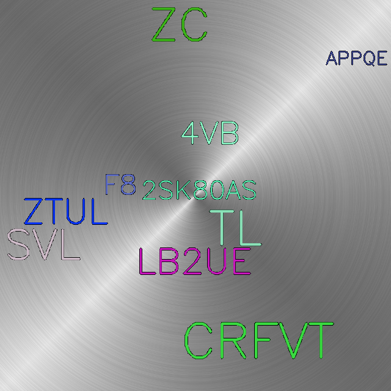
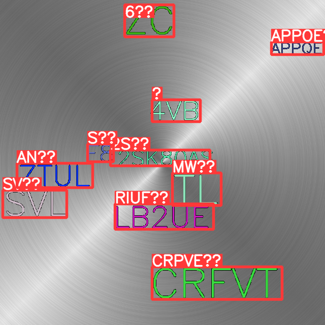

# Using_yolov5_text_detection_tesseract_OCR
Using YOLOv5 model for text detection + pytesseract for OCR
Dataset generated using repo: https://github.com/tanmaya48/Text-datagen-for-YOLOv5-training

